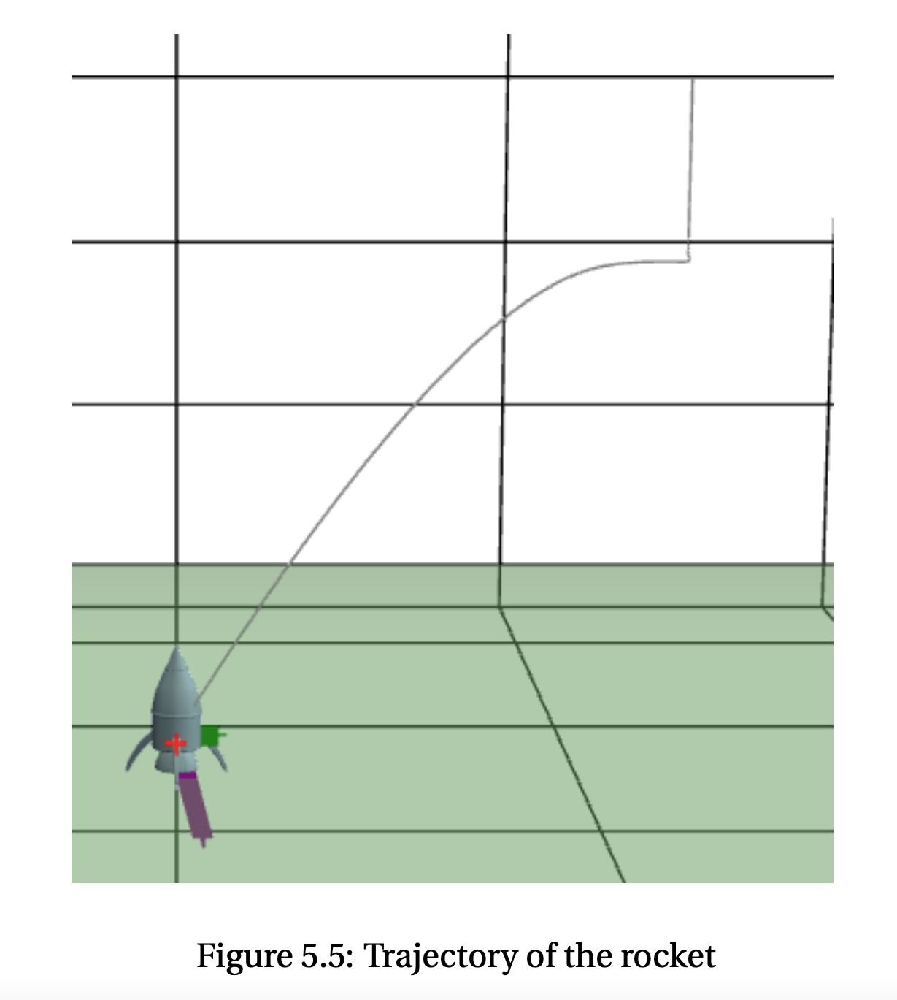
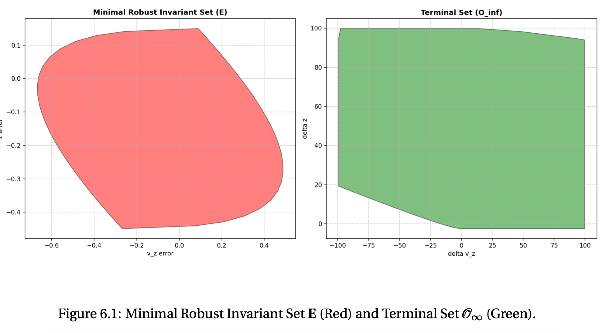
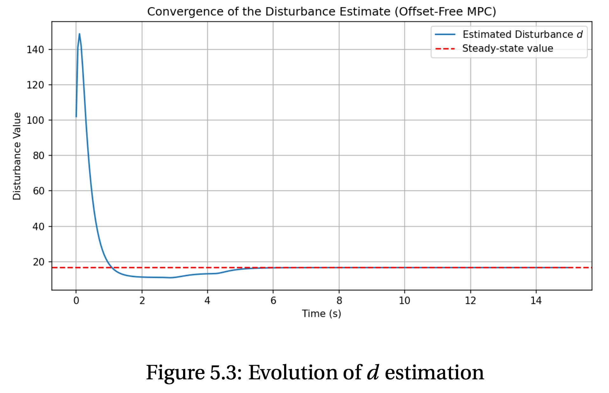

# 🚀 6-DOF Rocket Landing: Nonlinear & Robust MPC

>**Implementing high-precision vertical descent and landing using advanced Model Predictive Control architectures.**

---

## 📌 Project Overview

This project involves the design and implementation of a comprehensive control suite for a 6-DOF rocket landing mission. The system navigates from linearized subsystem control to centralized **Nonlinear MPC**, addressing real-world challenges such as **external disturbances**, **model mismatches**, and **recursive feasibility**.

By leveraging the **CasADi** framework and a custom **RK4 integrator**, the controller achieves high-precision vertical descent even under extreme initial conditions like a 30° roll.

 

## 🏗️ System Architecture & Modeling

### 1. Dynamics & Linearization
The nonlinear rocket dynamics were linearized around a trim point and decoupled into four controllable subsystems to simplify the control task near equilibrium :
* **Subsystem X & Y:** Manages lateral position and pitch/yaw dynamics via gimbal deflection ($\delta_1, \delta_2$).
* **Subsystem Z:** Controls vertical motion dominated by average thrust power ($P_{avg}$).
* **Subsystem Roll:** Stabilizes the rocket's orientation using differential thruster power ($P_{diff}$).

### 2. Control Stack
* **Velocity MPC:** Designed individual controllers for each subsystem, enforcing hard terminal invariant set constraints ($\mathcal{O}_{\infty}$) computed via the **Discrete Algebraic Riccati Equation (DARE)** to ensure stability and recursive feasibility .
* **Hierarchical PID-MPC:** Implemented a cascaded architecture where a **PID position controller** generates velocity setpoints tracked by the underlying MPC layer.

---

## 🛡️ Robustness & Disturbance Rejection

### Robust Tube MPC
To guarantee a safe landing ($z \ge 0$) under additive disturbances, a **Robust Tube MPC** was engineered:
* **Minimal Robust Invariant Set (mRPI):** Computed to define a bounded "tube" around the nominal trajectory.
* **Constraint Tightening:** Reserves actuator authority specifically for disturbance rejection, ensuring the actual state remains within the safety tube.

### Offset-Free Tracking
Integrated a **Luenberger disturbance observer** to eliminate steady-state errors caused by mass mismatches (e.g., fuel consumption or payload changes).
* **Tuning:** Observer poles were placed at $[0.7, 0.75]$ to balance convergence speed with noise sensitivity.

  
  
  
<em>Left: Invariant set of Robust MPC controller Right: Disturbance rejection</em>

---

## 🧠 Nonlinear MPC (NMPC)
Utilized the **CasADi** optimization framework to implement a centralized NMPC that optimizes the full state and input vectors simultaneously.
* **Discretization:** Implemented a custom **Runge-Kutta 4 (RK4)** integrator to maintain high prediction accuracy during aggressive maneuvers.
* **Soft Constraints:** Utilized slack variables ($\sigma$) with heavy penalties to handle model mismatches and prevent solver infeasibility.

---

## 📊 Performance Comparison

| Feature | Nonlinear MPC (CasADi) | Robust Tube + Nominal MPC |
| :--- | :--- | :--- |
| **Model Accuracy** | Full nonlinear dynamics | Linearized subsystems |
| **Computation** | High (Non-convex optimization)  | Extremely Fast (QP-based) |
| **Safety** | Heuristic (Soft constraints) | Theoretical guarantees (mRPI) |
| **Coupling** | Exploits nonlinear coupling | Ignores inter-axis coupling |

---

### 🎓 Acknowledgments
Developed as part of the M.Sc. Robotics curriculum at **EPFL**.
* **Team:** Alexandros Dellios, Tom Herrmann, Salah Slaoui Hasnaoui.
* **Supervision:** Prof. Colin Jones.
